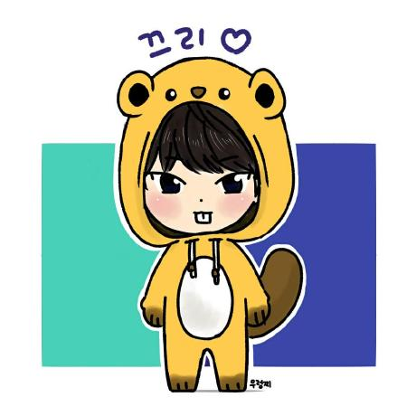

# 알고리즘  

## 백준 문제

- [구슬 탈출 2	] (https://www.acmicpc.net/problem/13460) 

- [2048 (Easy)] (https://www.acmicpc.net/problem/12100)

- [뱀] (https://www.acmicpc.net/problem/3190) 

- [시험 감독] (https://www.acmicpc.net/problem/13458) 

- [주사위 굴리기] (https://www.acmicpc.net/problem/14499)

- [테트로미노] (https://www.acmicpc.net/problem/14500)

- [퇴사] (https://www.acmicpc.net/problem/14501) 

- [연구소] (https://www.acmicpc.net/problem/14502)	

- [로봇 청소기] (https://www.acmicpc.net/problem/14503)

- [연산자 끼워넣기] (https://www.acmicpc.net/problem/14888)	

- [스타트와 링크] (https://www.acmicpc.net/problem/14889)	

- [경사로] (https://www.acmicpc.net/problem/14890)

- [톱니바퀴] (https://www.acmicpc.net/problem/14891)			

- [감시] (https://www.acmicpc.net/problem/15683)

- [사다리 조작] (https://www.acmicpc.net/problem/15684)

- [드래곤 커브] (https://www.acmicpc.net/problem/15685)		

- [치킨 배달] (https://www.acmicpc.net/problem/15686)	

- [큐빙] (https://www.acmicpc.net/problem/5373)	

- [인구 이동] (https://www.acmicpc.net/problem/16234)	

- [나무 재테크] (https://www.acmicpc.net/problem/16235)	

- [아기 상어] (https://www.acmicpc.net/problem/16236)	

- [미세먼지 안녕!] (https://www.acmicpc.net/problem/17144)			

- [낚시왕] (https://www.acmicpc.net/problem/17143)

- [이차원 배열과 연산] (https://www.acmicpc.net/problem/17140)		

- [연구소 3] (https://www.acmicpc.net/problem/17142)

- [게리맨더링 2] (https://www.acmicpc.net/problem/17779)

- [새로운 게임 2] (https://www.acmicpc.net/problem/17837)

- [원판 돌리기] (https://www.acmicpc.net/problem/17822)

- [주사위 윷놀이] (https://www.acmicpc.net/problem/17825)		

- [모노미노도미노 2] (https://www.acmicpc.net/problem/20061)		

- [청소년 상어] (https://www.acmicpc.net/problem/19236) 

- [어른 상어] (https://www.acmicpc.net/problem/19237)	

- [스타트 택시] (https://www.acmicpc.net/problem/19238)			

- [컨베이어 벨트 위의 로봇] (https://www.acmicpc.net/problem/20055)	

- [마법사 상어와 파이어볼] (https://www.acmicpc.net/problem/20056)

- [마법사 상어와 토네이도] (https://www.acmicpc.net/problem/20057)

- [마법사 상어와 파이어스톰] (https://www.acmicpc.net/problem/20058)

- [상어 초등학교] (https://www.acmicpc.net/problem/21608)

- [상어 중학교] (https://www.acmicpc.net/problem/21609)		

- [마법사 상어와 비바라기] (https://www.acmicpc.net/problem/21610)	

- [마법사 상어와 블리자드] (https://www.acmicpc.net/problem/21611)

- [주사위 굴리기 2] (https://www.acmicpc.net/problem/23288) 

- [온풍기 안녕!] (https://www.acmicpc.net/problem/23289)	

- [마법사 상어와 복제] (https://www.acmicpc.net/problem/23290)		

- [어항 정리] (https://www.acmicpc.net/problem/23291)

